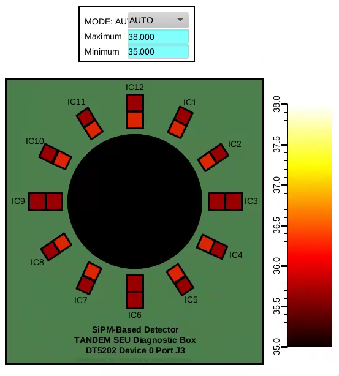
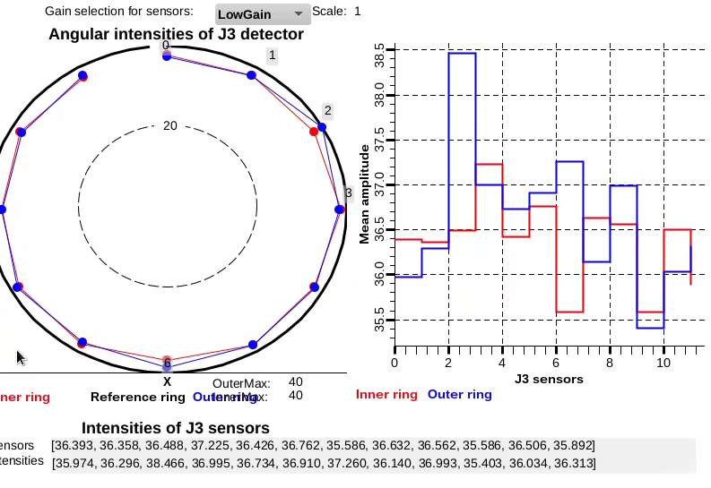

# PVAccess Server for the CAEN DT5202 SiPM DAQ

This application provides a PVAccess server for the **CAEN DT5202 SiPM Data Acquisition (DAQ) system**.

The server monitors the output directory for data files generated by the **JanusC** application. When a new file is detected, it is processed and the data from all recorded triggers are accumulated. The server then publishes the following channel-wise arrays through PVAccess:

- b0LGMean, b0HGMean – Mean channel amplitudes for the low-gain and high-gain acquisition paths.
- b0LGRMS, b0HGRMS – Standard deviation (RMS) of the channel amplitudes.
- b0LGP2P, b0HGP2P – Peak-to-peak channel amplitudes.

The plugin module epicsdev_caen_dt5202/**beamloss.py** provides additional PVs where it computes the beam flux for groups of SiPM sensors arranged in circular rings around the beam pipe.

## OPI screens for plane J3 of the Tandem Diagnostic Box
The bob files and scripts in the phoebus folder are provided by Julio Renta.

